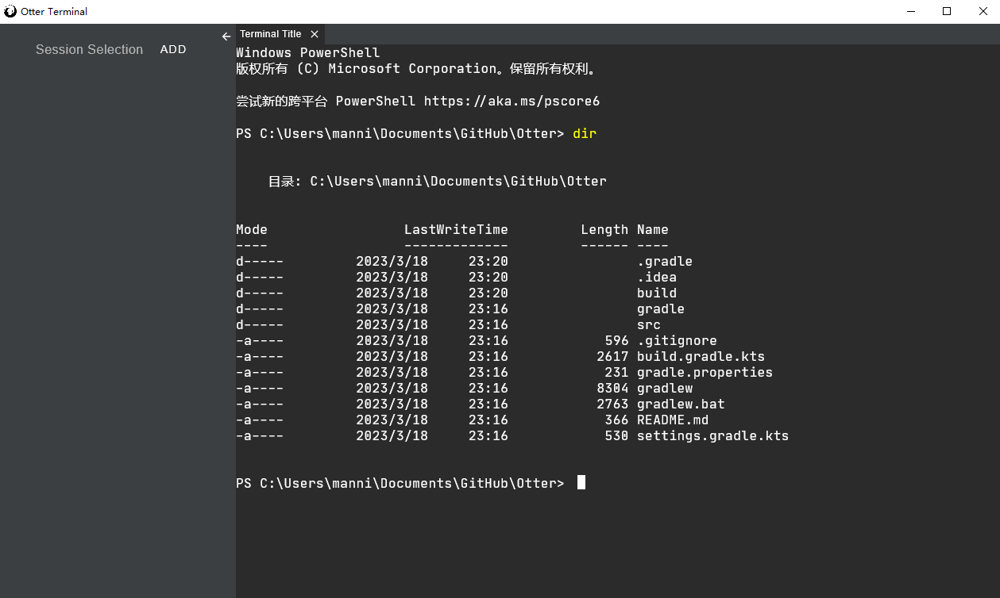

# Otter Terminal

I want to build a terminal like XShell

TODO:

- [ ]  Session manipulation
    - [x] Session add
    - [x] Session delete
    - [ ] Session edit
- [ ] `Vim` and other special linux command support
- [ ] Text selection and copy
- [ ] Scroll

There a long way to go....



# Run The Project

```
./gradlew run
```